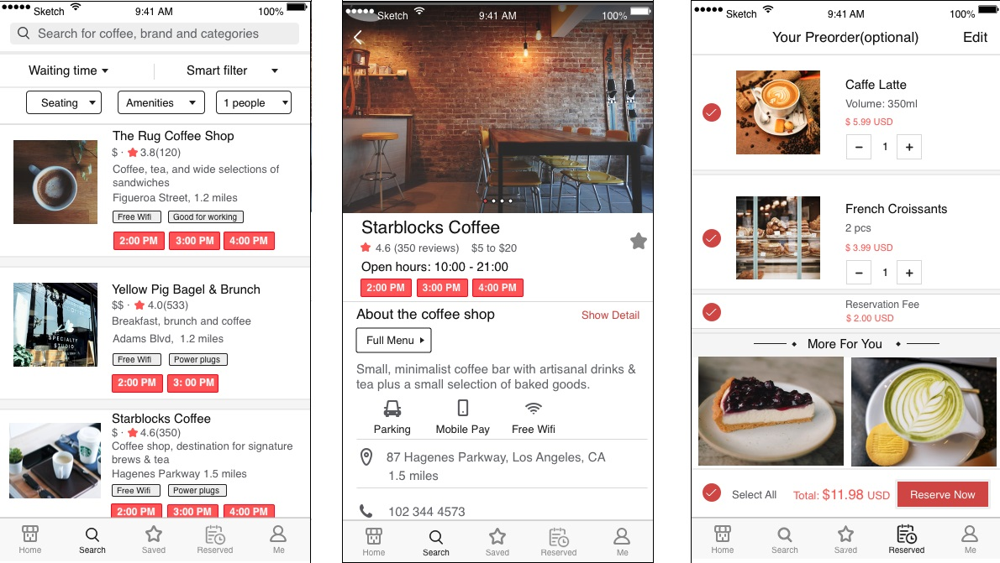
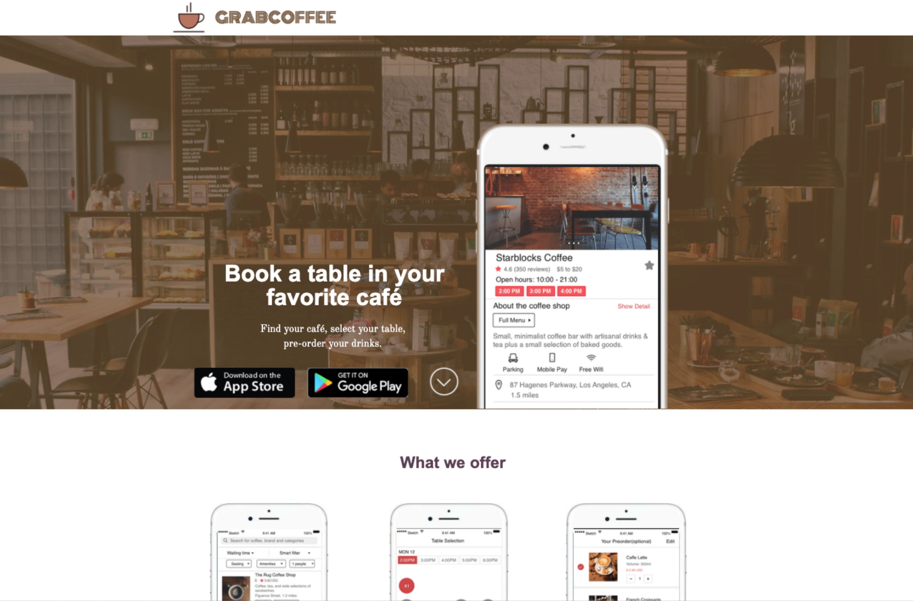

# UX-Desgin-GrabCoffee-Sketch

Startup Pitch: https://bit.ly/36EHqqL  
Prototype(Sketch) demo link: https://bit.ly/2JBleox  
Landing page: https://bit.ly/36vdOvK  
FaceBook page: https://www.facebook.com/grabcoffees   

This is a café table booking app startup pitch. Topics include competitive analysis, identification of marketplace opportunities, value innovation, rapid prototyping (in Sketch), customer discovery and designing for conversion using metrics.   

   

